<a id="readme-top"></a>

<div align="center">
  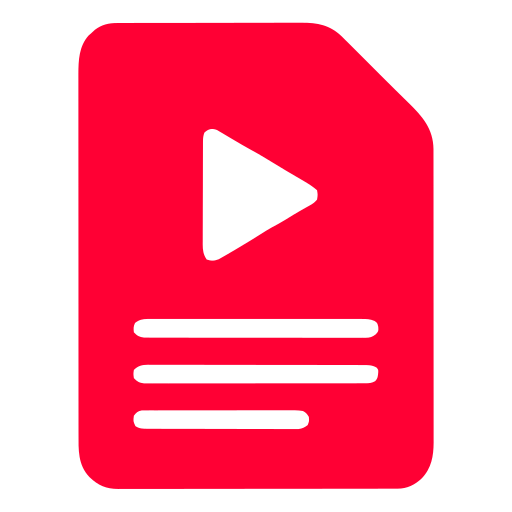

  <h1>Transcrev</h1>

  <p>Plataforma web para extrair, organizar, editar e exportar transcrições de vídeos do YouTube.</p>

  <p>
    
    
    
  </p>

  <p>
    
    
    
    
    
    
    
    
    
  </p>
</div>

> [!NOTE]
> O Transcrev está funcional para uso local, possui ambiente Docker completo,
> suíte automatizada e CI configurados. Não há uma instância pública hospedada
> neste momento.

## Sumário

- [Visão geral](#visão-geral)
- [Capturas de tela](#capturas-de-tela)
- [Funcionalidades](#funcionalidades)
- [Arquitetura](#arquitetura)
- [Modelo de dados e decisões](#modelo-de-dados-e-decisões)
- [Segurança e privacidade](#segurança-e-privacidade)
- [Stack](#stack)
- [Estrutura do projeto](#estrutura-do-projeto)
- [Execução local](#execução-local)
- [E-mail local](#e-mail-local)
- [Exportações](#exportações)
- [Variáveis de ambiente](#variáveis-de-ambiente)
- [Testes e qualidade](#testes-e-qualidade)
- [CI](#ci)
- [Observações](#observações)
- [Autor](#autor)

## Visão geral

O Transcrev transforma URLs de vídeos do YouTube em transcrições estruturadas
para leitura e organização. A aplicação separa o processamento pesado do
request HTTP, mantém uma Biblioteca privada por usuário e oferece um Workspace
para transformar uma transcrição em um documento pessoal editável.

Uma decisão central do produto é separar claramente a fonte do conteúdo da
edição do usuário:

```text
Video → Transcript (original, imutável) → UserTranscript → UserDocument (privado e editável)
```

O `Transcript` é a fonte original compartilhada internamente. O
`UserDocument` pertence à relação privada `UserTranscript`; editar, restaurar
ou exportar esse documento nunca modifica o vídeo, os segmentos, os capítulos
ou o conteúdo de outro usuário.

## Capturas de tela

As imagens abaixo foram capturadas da aplicação em execução local e apresentam
os principais fluxos do produto.

### 1. Home — extração rápida

<p align="center">
  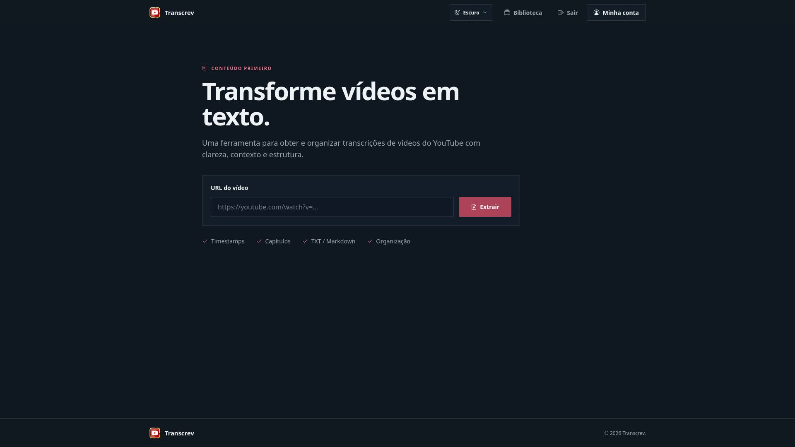
</p>

A entrada principal concentra a URL do vídeo e inicia o fluxo de extração.

### 2. Biblioteca — organização pessoal

<p align="center">
  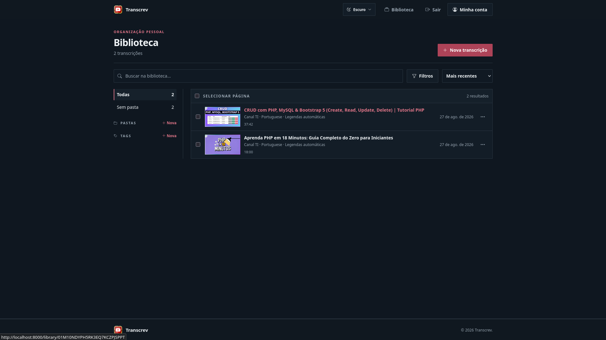
</p>

A Biblioteca reúne transcrições privadas com busca, filtros, ordenação, pastas
e tags.

### 3. Ações da Biblioteca

<p align="center">
  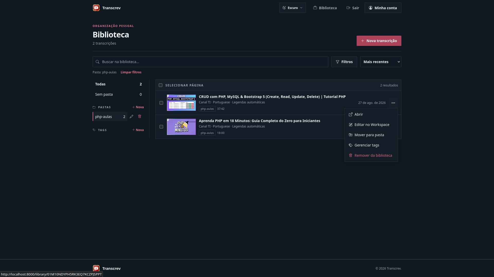
</p>

O menu contextual permite abrir a fonte, editar no Workspace, mover para uma
pasta, gerenciar tags ou remover o item da Biblioteca.

### 4. Tags — organização em lote

<p align="center">
  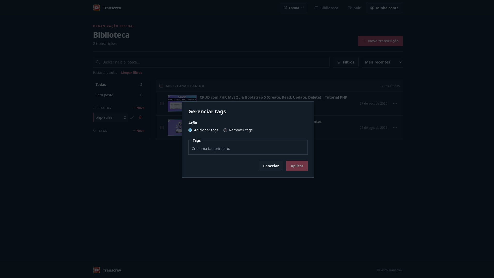
</p>

As ações em massa permitem associar ou remover tags dos itens selecionados.

### 5. Página da transcrição — fonte de leitura

<p align="center">
  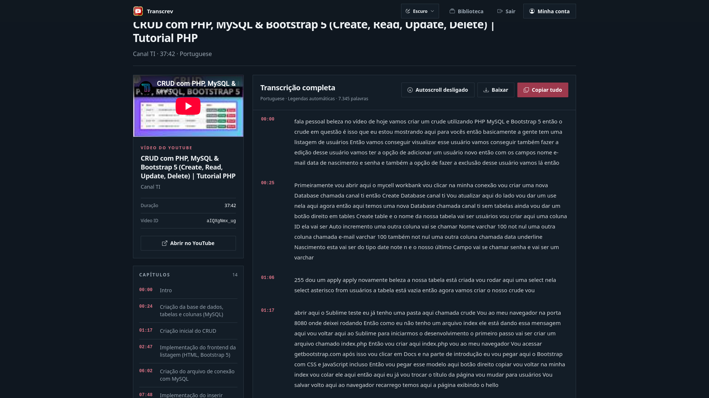
</p>

A fonte mostra o vídeo, capítulos e blocos de texto com timestamps, além das
ações de baixar, copiar e abrir no Workspace.

### 6. Download da transcrição original

<p align="center">
  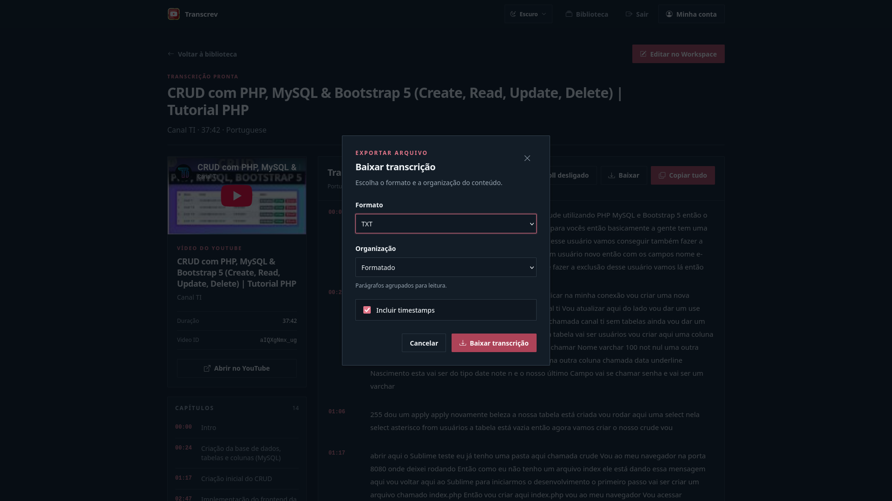
</p>

O download original permite escolher TXT ou Markdown, organização do conteúdo e
inclusão de timestamps.

### 7. Workspace — fonte e documento privado

<p align="center">
  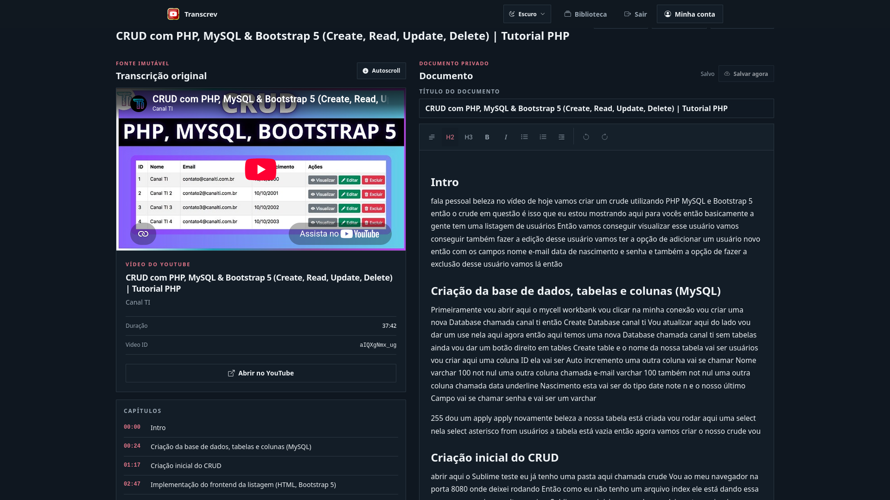
</p>

O Workspace mantém a fonte imutável à esquerda e o documento pessoal Tiptap à
direita, com autosave e controles de formatação.

### 8. Histórico de versões

<p align="center">
  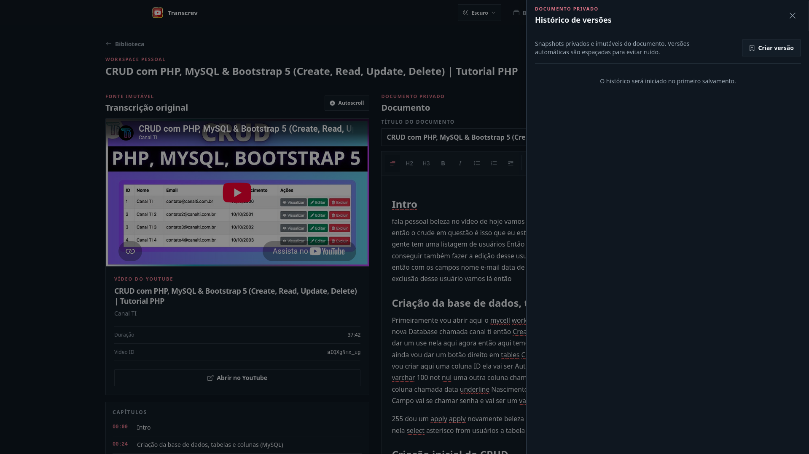
</p>

O painel lateral concentra snapshots privados, versões manuais e a criação de
novos checkpoints do documento.

### 9. Exportar documento

<p align="center">
  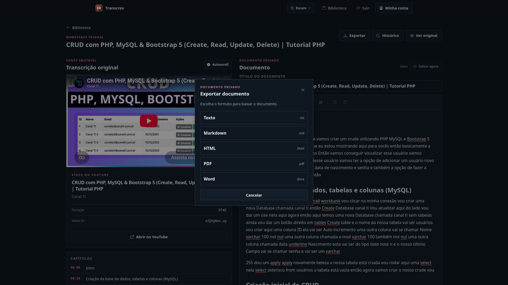
</p>

O documento editado pode ser exportado em Texto, Markdown, HTML, PDF ou Word.

## Funcionalidades

### Extração e leitura

- validação de URLs do YouTube;
- extrações com estados pendente, processando, pronta ou falha;
- processamento assíncrono na fila `transcripts`;
- worker com `yt-dlp` para a extração real;
- vídeo, capítulos, blocos e timestamps estruturados;
- downloads da transcrição original em TXT e Markdown.

### Uso sem conta e autenticação

- até 3 extrações anônimas por identidade pseudônima persistente;
- criação preguiçosa de `GuestUsage` e reserva transacional de quota;
- adoção das extrações do navegador após login ou cadastro;
- cadastro, login e logout por e-mail e senha;
- verificação de e-mail em PT-BR;
- login com Google;
- suporte a Microsoft/Outlook quando o provider estiver configurado;
- proteção contra vínculo automático de conta social por igualdade de e-mail.

### Biblioteca privada

- busca por título do vídeo, canal e tags;
- filtros por pasta, tag, idioma e fonte;
- ordenação e paginação;
- folders, tags e ações em massa;
- acesso à visualização da fonte e ao Workspace.

### Workspace e histórico

- editor Tiptap com parágrafos, headings 2/3, listas, citações, negrito,
  itálico e quebras de linha;
- título editável, autosave com debounce e uma requisição em voo;
- optimistic locking com `lock_version` e conflito HTTP 409;
- player do YouTube e timestamps/blocos clicáveis;
- criação lazy: abrir o Workspace não persiste documento sem edição;
- baseline, checkpoints automáticos, versões manuais e preview read-only;
- restauração com backup do estado anterior e retenção de até 100 revisões
  automáticas por documento.

## Arquitetura

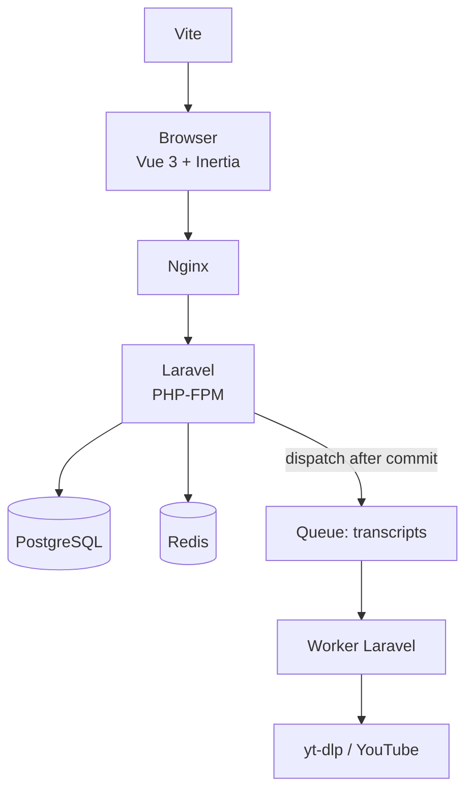

1. o navegador envia uma URL válida;
2. Laravel cria a extração e reserva quota quando aplicável;
3. `ExtractTranscriptJob` é despachado após o commit;
4. Redis entrega o job à fila `transcripts`;
5. o worker executa o provider configurado;
6. vídeo, transcrição, segmentos e capítulos são persistidos;
7. a interface apresenta o resultado ou o estado de falha tratável.

## Modelo de dados e decisões

| Conceito | Responsabilidade |
| --- | --- |
| `Video` / `Transcript` | Fonte global de vídeo e transcrição original, imutável para a edição do usuário. |
| `UserTranscript` | Relação privada entre usuário e `Transcript`; base do owner scoping. |
| `UserDocument` | Documento Tiptap JSON editável, único por `UserTranscript`. |
| `UserDocumentRevision` | Snapshot imutável de baseline, checkpoint, versão manual ou backup. |
| `SocialAccount` | Identidade OAuth separada, sem tokens persistidos. |
| `GuestUsage` | Ledger de quota vinculado ao token pseudônimo do navegador. |
| `Folder` / `Tag` | Organização privada da Biblioteca. |

O `lock_version` protege saves e restaurações contra atualizações stale. A
criação inicial de documento/baseline e a alocação de revisões usam transações
curtas e locks no banco.

## Segurança e privacidade

- recursos privados são resolvidos a partir do usuário autenticado e de seu
  `UserTranscript`; acessos cruzados retornam 404 quando aplicável;
- props globais do Inertia expõem somente o nome do usuário para o header;
- e-mail, IDs internos, identificadores sociais e tokens OAuth não são
  enviados como dados globais;
- contas locais exigem confirmação de e-mail em rotas protegidas por
  `verified`;
- OAuth não persiste access token, refresh token ou ID token e não cria
  vínculo automático com conta local de mesmo e-mail;
- o JSON do editor é validado por schema, tamanho, profundidade, nós e marks
  autorizadas;
- HTML é escapado; PDF usa Dompdf sem recursos remotos ou execução PHP; DOCX
  é construído diretamente a partir do JSON;
- headers básicos incluem `X-Content-Type-Options`, `Referrer-Policy` e
  `X-Frame-Options`.

Essas medidas reduzem a superfície de exposição, mas não substituem a
configuração correta de HTTPS, e-mail e credenciais no ambiente de execução.

## Stack

| Camada | Tecnologias |
| --- | --- |
| Backend | PHP 8.5, Laravel 13 |
| Frontend | Vue 3, Inertia.js, JavaScript, Tailwind CSS |
| Editor | Tiptap 3 |
| Banco de dados | PostgreSQL 18 |
| Cache e fila | Redis 8 |
| Extração | yt-dlp, Node.js e Python no worker |
| Exportação | Dompdf, PHPWord |
| Infraestrutura local | Docker Compose, Nginx, PHP-FPM, Mailpit |
| Testes | Pest 4, PHPUnit 12 |
| Qualidade | Laravel Pint, Larastan/PHPStan |
| CI | GitHub Actions, Dependabot |

## Estrutura do projeto

```text
transcricao-youtube-videos/
├── app/
│   ├── Actions/              # Casos de uso e regras transacionais
│   ├── Http/                 # Controllers, requests e middleware
│   ├── Jobs/                 # Extração assíncrona
│   ├── Models/               # Eloquent e relações de domínio
│   ├── Transcript/           # Providers, parser e apresentação da fonte
│   └── UserDocument/         # Exportação do documento editado
├── database/
│   ├── factories/
│   └── migrations/
├── docker/
│   ├── nginx/
│   └── php/
├── resources/
│   ├── css/
│   └── js/                   # Páginas Inertia e componentes Vue
├── routes/
├── tests/
│   ├── Feature/
│   └── Unit/
├── docker-compose.yml
└── README.md
```

## Execução local

### Pré-requisitos

- Git;
- Docker Engine e Docker Compose;
- Node.js 22+ e npm — o Vite gera assets montados pelo Nginx local.

```bash
git clone https://github.com/auhauhbr/transcricao-youtube-videos.git
cd transcricao-youtube-videos

cp .env.example .env
npm ci
npm run build
docker compose up -d --build
```

Gere uma chave e copie o valor mostrado para `APP_KEY=` no `.env` do host. O
arquivo é montado como somente leitura dentro dos containers.

```bash
docker compose exec -T app php artisan key:generate --show
```

Depois de preencher `APP_KEY`, aplique as migrations:

```bash
docker compose exec -T app php artisan migrate
```

| Serviço | Endereço |
| --- | --- |
| Aplicação | http://localhost:8000 |
| Health check | http://localhost:8000/up |
| Mailpit | http://localhost:8025 |

```bash
docker compose down
```

O serviço web local usa o provider `fake` no request da aplicação; o worker
usa `yt-dlp` para extrações reais na fila. A disponibilidade da extração real
depende do YouTube e do ambiente externo.

### OAuth local

Google e Microsoft requerem credenciais próprias. Preencha somente no `.env`
local as variáveis correspondentes, sem versionar valores sensíveis:

```dotenv
GOOGLE_CLIENT_ID=
GOOGLE_CLIENT_SECRET=
GOOGLE_REDIRECT_URI=http://localhost:8000/auth/google/callback

MICROSOFT_CLIENT_ID=
MICROSOFT_CLIENT_SECRET=
MICROSOFT_REDIRECT_URI=http://localhost:8000/auth/microsoft/callback
MICROSOFT_TENANT_ID=common
```

O botão Microsoft é exibido apenas quando sua configuração está completa.

## E-mail local

O desenvolvimento envia e-mails SMTP para o Mailpit. Links de confirmação
aparecem em http://localhost:8025. As configurações locais usam
`mailpit:1025`; não é necessário Gmail ou credenciais de e-mail.

## Exportações

| Conteúdo | TXT | Markdown | HTML | PDF | DOCX |
| --- | :---: | :---: | :---: | :---: | :---: |
| Transcrição original | ✓ | ✓ | — | — | — |
| Documento editado | ✓ | ✓ | ✓ | ✓ | ✓ |

O download original sempre usa `Transcript`. A exportação de documento usa o
`UserDocument` persistido ou, se ele ainda não existir, o seed do Workspace
sem criar linhas no banco. Alterações locais pendentes são salvas antes do
download; conflitos ou falhas de save o interrompem.

## Variáveis de ambiente

O arquivo [.env.example](.env.example) contém os defaults locais. Os grupos
mais importantes são:

| Grupo | Finalidade |
| --- | --- |
| `APP_*` | nome, URL, ambiente, debug e chave da aplicação. |
| `DB_*` / `DB_URL` | conexão PostgreSQL. |
| `REDIS_*` / `REDIS_URL` | cache e fila Redis. |
| `MAIL_*` | SMTP; localmente aponta para Mailpit. |
| `GOOGLE_*` | credenciais e callback OAuth do Google. |
| `MICROSOFT_*` | credenciais, callback e tenant Microsoft. |
| `TRANSCRIPT_PROVIDER` | provider de transcrição (`fake` ou `yt_dlp`). |
| `YT_DLP_*` | binário, runtime e limites do worker. |

Nunca versione `APP_KEY`, senhas, client secrets, tokens ou valores reais de
infraestrutura.

## Testes e qualidade

```bash
composer lint
composer analyse
composer test
npm run build
```

Na auditoria final, a suíte passou com **272 testes** e **2.039 assertions**.
Os testes usam `APP_ENV=testing`, SQLite em memória, cache `array`, queue
`sync`, sessão `array` e mailer `array`; não acessam PostgreSQL, Redis, Mailpit
ou YouTube reais do ambiente de desenvolvimento.

## CI

O workflow [CI](.github/workflows/ci.yml) é disparado em pushes e pull
requests para `main` e possui três jobs:

| Job | Validações |
| --- | --- |
| Backend quality | `composer install`, Pint, Larastan, suíte completa e `composer audit`. |
| Frontend build | `npm ci` e `npm run build`. |
| Docker build | build da imagem `app` após os jobs anteriores. |

O Dependabot acompanha Composer, npm e GitHub Actions. O CI não executa deploy
automático.

## Observações

- não há instância pública do Transcrev atualmente;
- extrações reais dependem da disponibilidade e das mudanças do YouTube;
- OAuth requer aplicações e callbacks configurados pelo operador;
- Microsoft permanece disponível no backend e aparece na interface somente
  quando configurado.

## Autor

Projeto desenvolvido por [@auhauhbr](https://github.com/auhauhbr).

<p align="right">(<a href="#readme-top">voltar ao topo</a>)</p>
